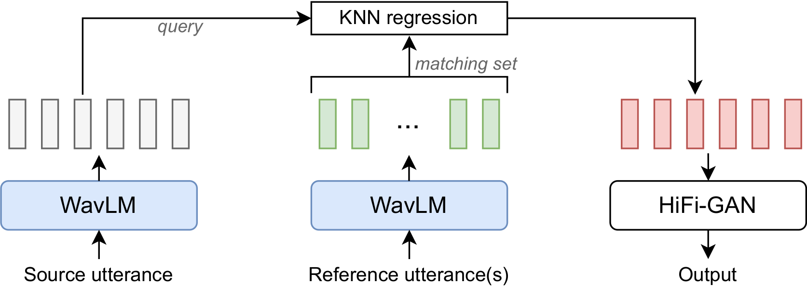

# Voice Conversion With Just Nearest Neighbors (kNN-VC)

The official code repo! This repo contains training and inference code for kNN-VC -- an any-to-any voice conversion model from our paper, "Voice Conversion With Just k-Nearest Neighbors". The trained checkpoints are available under the 'Releases' tab and through `torch.hub`. 

Links:

- Arxiv paper: [https://arxiv.org/abs/2305.18975](https://arxiv.org/abs/2305.18975)
- Colab quickstart: <a target="_blank" href="https://colab.research.google.com/github/bshall/knn-vc/blob/master/knnvc_demo.ipynb"></a>
- Interspeech proceedings: [https://www.isca-speech.org/archive/interspeech_2023/baas23_interspeech.html](https://www.isca-speech.org/archive/interspeech_2023/baas23_interspeech.html)
- Demo page with samples: [https://bshall.github.io/knn-vc/](https://bshall.github.io/knn-vc/)




Figure: kNN-VC setup. The source and reference utterance(s) are encoded into self-supervised features using WavLM. Each source feature is assigned to the mean of the k closest features from the reference. The resulting feature sequence is then vocoded with HiFi-GAN to arrive at the converted waveform output.

**Authors**:

- [Matthew Baas](https://rf5.github.io/)*
- [Benjamin van Niekerk](https://scholar.google.com/citations?user=zCokvy8AAAAJ&hl=en&oi=ao)*
- [Herman Kamper](https://www.kamperh.com/)

*Equal contribution

## Quickstart

We use `torch.hub` to make loading the model easy -- no cloning of the repo needed. The steps to perform inference are simple:

1. **Install dependancies**: we have 3 inference dependencies only `torch`, `torchaudio`, and `numpy`. Python must be at version 3.10 or greater, and torch must be v2.0 or greater.
2. **Load models**: load the WavLM encoder and HiFiGAN vocoder:

```python
import torch, torchaudio

knn_vc = torch.hub.load('bshall/knn-vc', 'knn_vc', prematched=True, trust_repo=True, pretrained=True)
# Or, if you would like the vocoder trained not using prematched data, set prematched=False.
```
3. **Compute features** for input and reference audio:

```python
src_wav_path = '<path to arbitrary 16kHz waveform>.wav'
ref_wav_paths = ['<path to arbitrary 16kHz waveform from target speaker>.wav', '<path to 2nd utterance from target speaker>.wav', ...]

query_seq = knn_vc.get_features(src_wav_path)
matching_set = knn_vc.get_matching_set(ref_wav_paths)
```

4. **Perform the kNN matching and vocoding**:

```python
out_wav = knn_vc.match(query_seq, matching_set, topk=4)
# out_wav is (T,) tensor converted 16kHz output wav using k=4 for kNN.
```

That's it! These default settings provide pretty good results, but feel free to modify the kNN `topk` or use the non-prematched vocoder.
Note: the target speaker from `ref_wav_paths` _can be anything_, but should be clean speech from the desired speaker. The longer the cumulative duration of all reference waveforms, the better the quality will be (but the slower it will take to run). The improvement in quality diminishes beyond 5 minutes of reference speech.

## Checkpoints

Under the releases tab of this repo we provide three checkpoints:

- The frozen WavLM encoder taken from the [original WavLM authors](https://github.com/microsoft/unilm/tree/master/wavlm), which we host here for convenience and torch hub integration.
- The HiFiGAN vocoder trained on layer 6 of WavLM features.
- The HiFiGAN vocoder trained on **prematched** layer 6 of WavLM features (the best model in the paper).

For the HiFiGAN models we provide both the generator inference checkpoint and full training checkpoint with optimizer states.

The performance on the LibriSpeech dev-clean set is summarized:

| checkpoint | WER (%) | CER (%) | EER (%) |
| ----------- | :-----------: | :----: | :--: |
| [kNN-VC with prematched HiFiGAN](https://github.com/bshall/knn-vc/releases/download/v0.1/prematch_g_02500000.pt) | 6.29 | 2.34 | 35.73 | 
| [kNN-VC with regular HiFiGAN](https://github.com/bshall/knn-vc/releases/download/v0.1/g_02500000.pt) | 6.39 | 2.41 | 32.55 | 


## Training

We follow the typical encoder-converter-vocoder setup for voice conversion. The encoder is WavLM, the converter is k-nearest neighbors regression, and vocoder is HiFiGAN. The only component that requires training is the vocoder:

1. **WavLM encoder**: we simply use the pretrained WavLM-Large model and do not train it for any part of our work. We suggest checking out the original [WavLM repo](https://github.com/microsoft/unilm) to train your own SSL encoder.
2. **kNN conversion model**: kNN is non-parametric and does not require any training :)
3. **HiFiGAN vocoder**: we adapt the original [HiFiGAN author's repo](https://github.com/jik876/hifi-gan) for vocoding WavLM features. This is the only part which requires training.

### HiFiGAN training

For training we require the same dependencies as the original HiFiGAN training [here](https://github.com/jik876/hifi-gan/blob/master/requirements.txt) -- namely `librosa`, `tensorboard`, `matplotlib`, `fastprogress`, `scipy`.
Then, to train the HiFiGAN:

1. **Precompute WavLM features of the vocoder dataset**: we provide a utility for this for the LibriSpeech dataset in `prematch_dataset.py`:

    ```bash
    usage: prematch_dataset.py [-h] --librispeech_path LIBRISPEECH_PATH
                            [--seed SEED] --out_path OUT_PATH [--device DEVICE]
                            [--topk TOPK] [--matching_layer MATCHING_LAYER]
                            [--synthesis_layer SYNTHESIS_LAYER] [--prematch]
                            [--resume]
    ```

    where you can specify `--prematch` or not to determine whether to use prematching when generating features or not. For example, to generate the dataset used to train the prematched HiFiGAN from the paper:
    `python prematch_dataset.py --librispeech_path /path/to/librispeech/root --out_path /path/where/you/want/outputs/to/go --topk 4 --matching_layer 6 --synthesis_layer 6 --prematch`

2. **Train HiFiGAN**: we adapt the training script from the [original HiFiGAN repo](https://github.com/jik876/hifi-gan) to work for WavLM features in `hifigan/train.py`. To train a hifigan model on the features you produced above:

    ```bash
    python -m hifigan.train --audio_root_path /path/to/librispeech/root/ --feature_root_path /path/to/the/output/of/previous/step/ --input_training_file data_splits/wavlm-hifigan-train.csv --input_validation_file data_splits/wavlm-hifigan-valid.csv --checkpoint_path /path/where/you/want/to/save/checkpoint --fp16 False --config hifigan/config_v1_wavlm.json --stdout_interval 25 --training_epochs 1800 --fine_tuning
    ```

    That's it! Once it is run up till 2.5M updates (or it starts to sound worse) you can stop training and use the pretrained checkpoint.


## Repository structure

```
├── data_splits                             # csv train/validation splits for librispeech train-clean-100
│   ├── wavlm-hifigan-train.csv
│   └── wavlm-hifigan-valid.csv
├── hifigan                                 # adapted hifigan code to vocode wavlm features
│   ├── config_v1_wavlm.json                # hifigan config for use with wavlm features
│   ├── meldataset.py                       # mel-spectrogram transform used during hifigan training
│   ├── models.py                           # hifigan model definition
│   ├── train.py                            # hifigan training script
│   └── utils.py                            # utilities used for hifigan inference/training
├── hubconf.py                              # torchhub integration
├── matcher.py                              # kNN matching logic and model wrapper
├── prematch_dataset.py                     # script to precompute wavlm features for librispeech
├── README.md                               
└── wavlm                                   
    ├── modules.py                          # wavlm helper functions (from original WavLM repo)
    └── WavLM.py                            # wavlm modules (from original WavLM repo)
```


## Acknowledgements

Parts of code for this project are adapted from the following repositories -- please make sure to check them out! Thank you to the authors of:

- HiFiGAN: https://github.com/jik876/hifi-gan
- WavLM: https://github.com/microsoft/unilm/tree/master/wavlm


## Citation

```bibtex
@inproceedings{baas2023knnvc,
  author={Matthew Baas and Benjamin van Niekerk and Herman Kamper},
  title={Voice Conversion With Just Nearest Neighbors},
  year=2023,
  booktitle={Interspeech},
}
```


